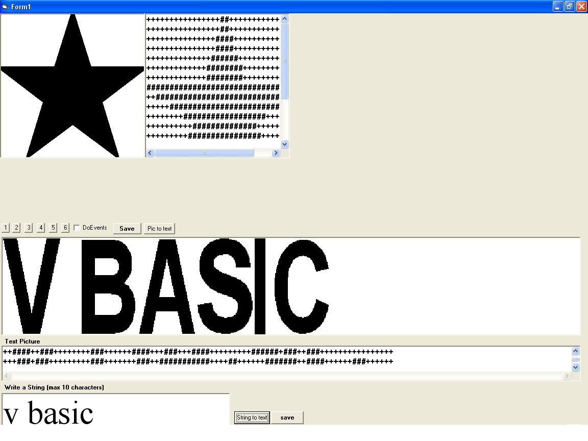



## text picture maker

### Description

----

----

###

----

###+###########

----

----

####

----

###++############

----

----

###

----

###++###

----

###

----

----

###

----

####++###

----

###

----

----

####+++###+++###########

----

----

###+++###+++###########

----

----

###++###

----

###

----

####+++

----

###+###

----

###

----

###+++

----

#######

----

###

----

####+++

----

#####

----

############

----

----

#####

----

###########

----

----

Do i need to say more.... make stuff like this for ur ftp server or readme files easily =)

And with a simple click save them to an text file...

plz vote and comment.... thx
 
### More Info
 

             |
---                |---
**Submitted On**   |2002-06-17 18:52:16
**By**             |[Jonathan Rossing](https://github.com/Planet-Source-Code/PSCIndex/blob/master/ByAuthor/jonathan-rossing.md)
**Level**          |Intermediate
**User Rating**    |5.0 (20 globes from 4 users)
**Compatibility**  |VB 4\.0 \(16\-bit\), VB 6\.0
**Category**       |[Graphics](https://github.com/Planet-Source-Code/PSCIndex/blob/master/ByCategory/graphics__1-46.md)
**World**          |[Visual Basic](https://github.com/Planet-Source-Code/PSCIndex/blob/master/ByWorld/visual-basic.md)
**Archive File**   |[text\_pictu14755410172002\.zip](https://github.com/Planet-Source-Code/jonathan-rossing-text-picture-maker__1-39911/archive/master.zip)

